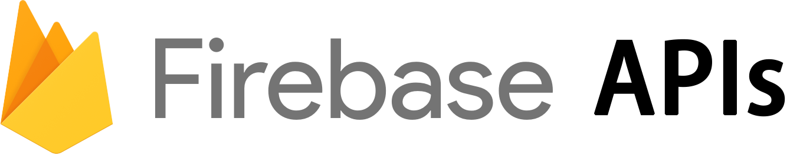

`<a name="readme-top"></a>`

<!-- 0101-Firebase Api Encapsulation -->
# Readme-Template-Light

<div align="center">
  <a href="#">
    
  </a>

<h3 align="center">Firebase-Api-Encapsulation</h3>

<p align="center">
    Elevate your Firebase development with secure and efficient API wrapper!
    <br />
    <a href="https://github.com/yuenci/Firebase-Api-Encapsulation/wiki"><strong>Explore the docs »</strong></a>
    <br />
    <br />
    <a href="https://github.com/yuenci/Firebase-Api-Encapsulation">View Demo</a>
    ·
    <a href="https://github.com/yuenci/Firebase-Api-Encapsulation/issues">Report Bug</a>
    ·
    <a href="https://github.com/yuenci/Firebase-Api-Encapsulation/issues">Request Feature</a>
  </p>
</div>

## 💻 Prerequisites

Before you begin, if you are using NPM, make sure that you have installed fairbase:

```bash
$ npm install firebase
```

Then copy API file to your project and import to script.

## ☕ Usecase

To use this project, follow these steps in the wiki:

1. [Authentication](https://github.com/yuenci/Firebase-Api-Encapsulation/wiki/Authentication-API-Encapsulation#usage)
2. [Firestore](https://github.com/yuenci/Firebase-Api-Encapsulation/wiki/Firestore-API-Encapsulation#usage)
3. [Storage](https://github.com/yuenci/Firebase-Api-Encapsulation/wiki/Storage-API-Encapsulation#usage)

## 📫 Contributing

To contribute this project, follow these steps:

1. Fork this repository.
2. Crie um branch: `git checkout -b <some_branch>`
3. Make your changes and confirm them: `git commit -m <message_commit>`
4. Push to the original branch: `git push origin <peoject_name> / <local>`
5. Create the pull request.

Alternatively, see the GitHub documentation on how to [create a pull request](https://help.github.com/en/github/collaborating-with-issues-and-pull-requests/creating-a-pull-request).

## 🤝 Collaborations

<a href="https://github.com/yuenci" target="_blank" >
  
</a>

Innis - yuenci1575270674@gmail.com

## 📝 License

This project is under license. See the [LICENSE](./LICENSE) file for more details.

<p >(<a href="#readme-top">⬆ Back to top</a>)</p>
