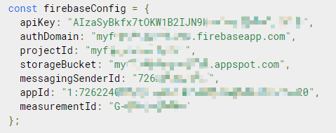

<a name="readme-top"></a>

# Readme-Template-Light


### Adjustments and improvements

The project is still under development and the next updates will be focused on the following tasks:

- [x] Task 1
- [x] Task 2
- [x] Task 3
- [ ] Task 4
- [ ] Task 5

## 💻 Prerequisites

Before you begin, make sure that you have met the following requirements:
<!---These are just example requirements. Add, duplicate or remove as needed--->
*	You have installed the latest version of <language/dependency/required>
*	You have a machine <Windows /Linux/Mac>. Indicate which operating system is compatible/not compatible.
*	You have <guide /link/documentação_relacionada_ao_projeto>.


## 🚀 Installing 

To install this project, follow these steps:

```bash
$ 
```

## ☕ Usecase

To use this project, follow these steps:
```
//command
```

Add execution commands and examples that you think users will find useful. Provides a reference ofoptions for bonus points!

## 📫 Contributing

To contribute this project, follow these steps:

1.	Fork this repository.
2.	Crie um branch: `git checkout -b <some_branch>`
3.	Make your changes and confirm them: `git commit -m <message_commit>`
4.	Push to the original branch: `git push origin <peoject_name> / <local>`
5.	Create the pull request.

Alternatively, see the GitHub documentation on how to [create a pull request](https://help.github.com/en/github/collaborating-with-issues-and-pull-requests/creating-a-pull-request).


## 🤝 Collaborations

<a href="https://github.com/yuenci" target="_blank" >
  
</a>

Your Name - [@your_twitter](https://twitter.com/your_username) - email@example.com


## 😄 Be one of the contributors

Want to be part of this project? Click HERE and read how to contribute.

## 📝 License

This project is under license. See the [LICENSE](./LICENSE) file for more details.

<p >(<a href="#readme-top">⬆ Back to top</a>)</p>


# Store

# Concept

## Data Model


https://firebase.google.com/docs/firestore/data-model

## Documents

A complete storage object, a complete JSON object

Similar to a row in table

```js
alovelace = {
    first : "Ada",
    last : "Lovelace",
    born : 1815
}
```

## Collections

A collection of JSON objects

Similar to a data TABLE

```js
users = {
	alovelace = {
        first : "Ada",
        last : "Lovelace",
        born : 1815
},
    alovelace : {
        first : "Ada",
        last : "Lovelace",
        born : 1815
    }
}
```

# Firestore API Encapsulation

## JavaScript Version

### Prerequisites

1. copy [storeHandle.js](./JavaScript%20version/storeHandle.js), [storageHandle.js](./JavaScript%20version/storageHandle.js) and [config.js](./JavaScript%20version/config.js) to your project

2. Go to [firbase console](https://console.firebase.google.com/) find your firebaseConfig and copy to [config.js](./JavaScript%20version/config.js)



3. import them to your script file:
```js
import { FBStore } from "./storageHandle.js";
import { FBStorage } from "./storageHandle.js"
import { firebaseConfig } from "./config.js";
```
4. Init Fairbase object:
```js
// for  Cloud Firestore service
const fbStore = new FBStore(firebaseConfig);

// for Firestore Storage service
const fbStorage = new FBStorage(firebaseConfig);
```

5. Configure Fairbase object:
```js
const fbStore = new FBStore(firebaseConfig);
fbStore.isMerge = true;
fbStore.debug = false;
```
6. Call Fairbase object methods
```js
const fbStore = new FBStore(firebaseConfig);

const user = {
    name: "innis",
    password: "123456"
};

fbStore.write("users", user);

```

### Usage
```js
const fbStore = new FBStore(firebaseConfig);
fbStore.isMerge = true;
fbStore.debug = false;
```
`isMerge`:
Used to control the behavior when overwriting the same file.
`isMerge` default value is `true`: merge
```js
// original
const user = {
    name: "innis",
    password: "123456"
};
```
```js
// call write method
const user = {
    password: "654321",
    gender: "male"
};
fbStore.write("users", user,"1");
```
```js
// result
const user = {
    name: "innis",
    password: "654321",
    gender: "male"
};
```

`isMerge` is `false`: override
```js
// original
const user = {
    name: "innis",
    password: "123456"
};
```
```js
// call write method
const user = {
    password: "654321",
    gender: "male"
};
fbStore.write("users", user,"1");
```
```js
// result
const user = {
    password: "654321",
    gender: "male"
};
```

https://firebase.google.com/docs/firestore/manage-data/add-data?authuser=0#set_a_document

`debug `:
Output the request details for each firebase in the console
Default value is `false`, close log detail
Set `true`, all request details and request results will be loged


#### Write
Use the automatically generated id
```js
const user = {
    name: "innis",
    password: "654321",
    gender: "male"
};

const fbStore = new FBStore(firebaseConfig);
let docID= await fbStore.write("users", user);
console.log(docID)

// FHVCiojIyhBfFNZaYadj
```
Use the custom id
```js
const user = {
    name: "innis",
    password: "654321",
    gender: "male"
};

const fbStore = new FBStore(firebaseConfig);
let res = await fbStore.write("users", user, 11);
console.log(res)

// true
```

https://firebase.google.com/docs/firestore/manage-data/add-data?authuser=0#add_a_document

#### Update
```js
const user = {
    name: "innis",
    password: "654321",
    gender: "male"
};

const fbStore = new FBStore(firebaseConfig);
let res = await fbStore.update("users", user, 11);
console.log(res)
// true
```
Update similar to write under `isMerge = false`, only updates specific fields and does not overwrite the entire document

https://firebase.google.com/docs/firestore/manage-data/add-data?authuser=0#update-data

#### Delete
```js
const fbStore = new FBStore(firebaseConfig);
let res = awaitfbStore.delete("users", 1111);
console.log(res)

// true
```

#### ReadDocument
```js
const fbStore = new FBStore(firebaseConfig);
const data = fbStore.readDocument("users", 1111)
```


#### ReadCollection
```js
const fbStore = new FBStore(firebaseConfig);
const data = fbStore.readCollection("users")
```


#### Query
Firebase supports querying data:
1. Compare
```js
["age", ">=", 20]
```

2. Contain
```js
["list", "array-contains", 1]
["list", "array-contains-any", [1, 2]]
```

3. Order
```js
["population", "desc"]
["age","asc"]
```

Usage
```js
let query = ["age", ">=", 20]
let data = await fbStore.query("users", query)

// output is array
```
```js
let queries = [["age", ">=", 20], ["age", "<=", 30]];
let data = await fbStore.query("users", queries)

// output is array
```
```js
let queries = [["age", ">=", 20], ["age", "<=", 30]];
let order = ["age", "asc"];
let data = await fbStore.query("users", queries, order)

// output is array
```